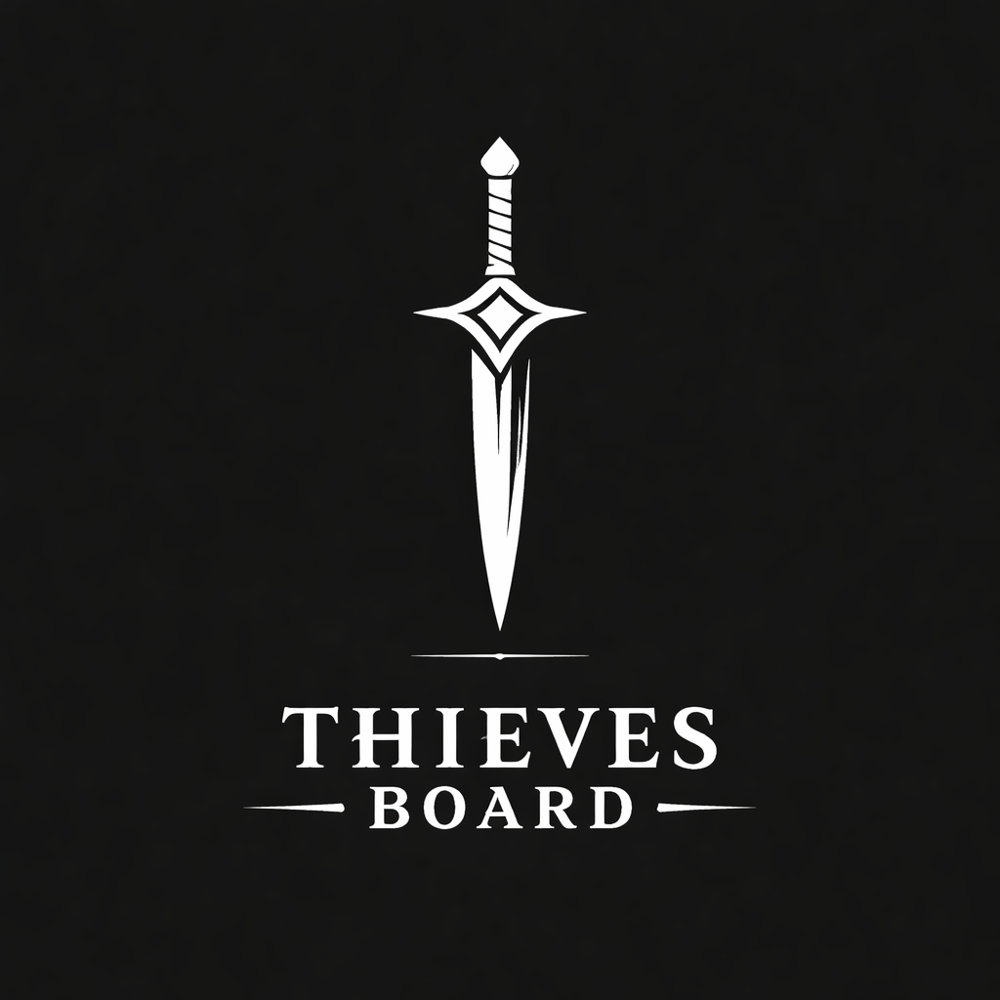

<div align="center">

# 🗡️ Thieves Board API



Backend do sistema **Thieves Board**, responsável por gerenciar fichas, quests e mecânicas de RPG.

</div>

---

<div align="center">

## 🚀 Tecnologias

</div>

- **Node.js**
- **NestJS**
- **Fastify** (adapter HTTP)
- **@fastify/multipart** (upload de arquivos / PDFs)
- **TypeScript**
- **MongoDB** (via Mongoose)
- **Zod** (validação de dados)
- **PDF Parsing** (extração de texto)

---

<div align="center">

## 📦 Funcionalidades

</div>

### 📄 Fichas de Personagem

- Upload de ficha em PDF  
- Extração automática de dados  
- Conversão para JSON estruturado  
- Persistência no MongoDB  
- Edição manual via API  

#### Endpoints

POST   /sheets/upload  
GET    /sheets  
GET    /sheets/:id  
PATCH  /sheets/:id  
DELETE /sheets/:id  

---

### 🎲 Sistema de Dados

- d2, d4, d6, d8, d10, d12, d20  
- Rolagem com quantidade (ex: 3d6)

---

### 📜 Sistema de Quests

- Listagem de quests  
- Seleção de quest ativa  
- Conclusão de quest  

---

<div align="center">

## 🧠 Arquitetura

</div>

```bash
src/
├── common/
├── quests/
├── dice/
├── sheets/
│   ├── controllers/
│   ├── services/
│   ├── parsers/
│   ├── schemas/
│   ├── maps/
│   └── mocks/

```

<div align="center">

## 🛠️ Instalação

</div>

pnpm install

---

<div align="center">

## ▶️ Rodando o projeto

</div>

pnpm start:dev

http://localhost:3000

---

<div align="center">

## 👤 Autor

Milton Teixeira

</div>
